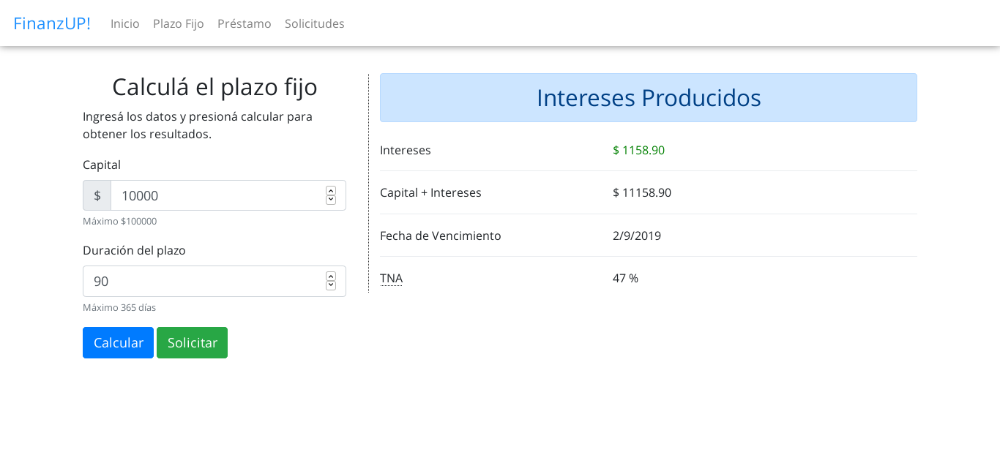
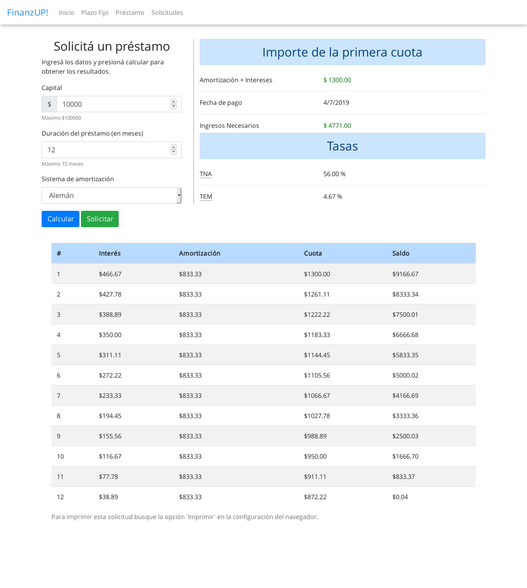
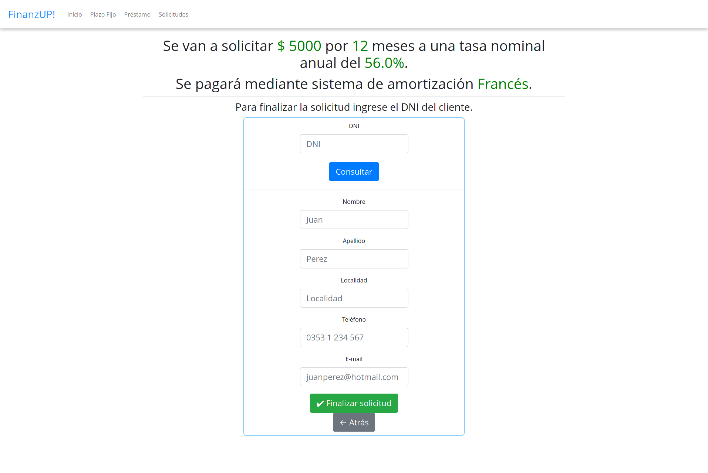
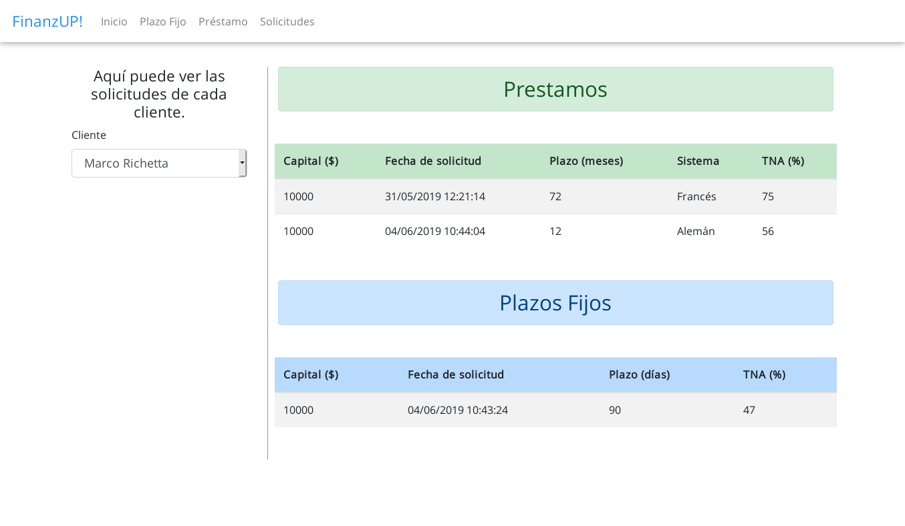

# FinanzUP!
Calculadora financiera para plazos fijos y préstamos.
Permite guardar usuarios y relacionarlos con los préstamos o plazos fijos solicitados.

## :gear: Instalación

```bash
# clonar el repositorio
git clone https://github.com/marcorichetta/FinanzUP.git

cd FinanzUP

# Crear un virtualenv (Opcional)
python3 -m venv mivirtualenv -> Nombre del virtualenv

# Activamos el virtualenv
source mivirtualenv/bin/activate (Linux)

# Instalar las dependencias
pip install -r requirements.txt
```
## :floppy_disk: Base de Datos
El sistema fue hecho con una base de datos sqlite3.
```
# Para generar la base de datos
# Además inserta 3 tasas de PF y Préstamo.
sqlite3 prueba.db < creacionDB.sql
```
## :hammer: Uso
```
$ flask run
```
Por defecto se puede ver la app en la dirección http://127.0.0.1:5000/ en el navegador.

## :tada: Screenshots

### Home


### Plazo Fijo


### Préstamo


### Solicitud


### Listado
